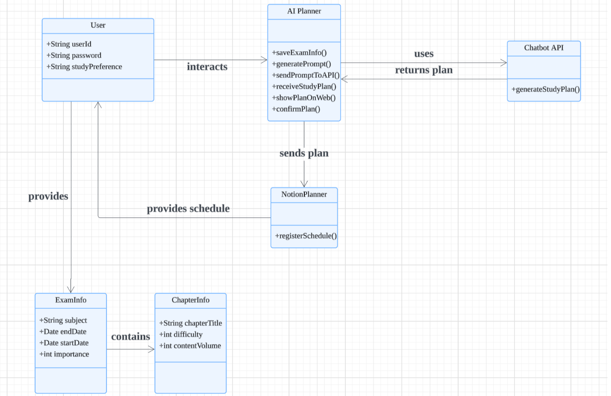
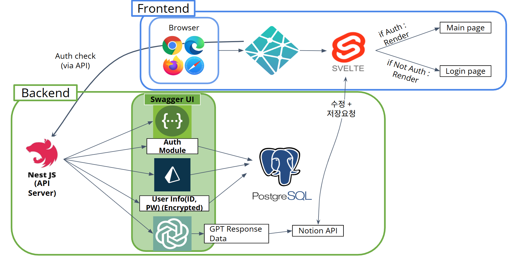

## 📑 목차

- [📖 사용자 가이드라인](#-사용자-가이드라인)
- [📚 프로젝트 개요](#-프로젝트-개요)
- [📊 클래스 다이어그램](#-클래스-다이어그램)
- [🏗️ 시스템 아키텍처](#️-시스템-아키텍처)
- [🛠️ 기술 스택](#️-기술-스택)
- [📋 주요 기능](#-주요-기능)
- [👥 팀 구성 및 역할](#-팀-구성-및-역할)
- [🗄️ 데이터베이스 설계](#️-데이터베이스-설계)
- [📆 프로젝트 일정](#-프로젝트-일정)
- [🔧 설치 및 실행](#-설치-및-실행)
- [📁 프로젝트 구조](#-프로젝트-구조)
- [📁 프로젝트 구조 및 주요 파일 설명](#-프로젝트-구조)
- [📖 API 문서](#-api-문서)
- [🗂 폴더별 담당자 및 역할](#-폴더별-담당자-및-역할)
- [🤝 기여하기](#-기여하기)
- [📝 라이선스](#-라이선스)
- [📞 문의](#-문의)

# AI Study Planner 📚

AI 기반 개인 맞춤형 학습 계획표 생성 서비스

## 📖 사용자 가이드라인
이 가이드는 **시험이 얼마남지않은 학생들**이 서비스를 처음 실행하여 학습 계획을 확인하고 Notion과 연동하는 과정을 설명합니다.
### 1. 서비스 소개
**AI Study Planner**는 사용자의 공부 성향과 과목 정보를 바탕으로 자동으로 학습 계획표를 생성해주는 서비스입니다.  
사용자는 추천된 계획을 확인하고, Notion에 연동하여 일정처럼 관리할 수 있습니다.

---

### 2. 시작하기 (Getting Started)

#### 회원가입
1. 메인 페이지 우측 상단의 **[회원가입]** 버튼 클릭
2. 사용자 ID, 비밀번호 입력하여 계정 생성

#### 로그인
1. 생성한 ID/PW로 로그인
2. 로그인하면 메인 페이지로 이동

---

### 3. 사용자 정보 설정

#### 학습 성향 등록
- 하루에 몇 개 과목을 공부하는지 (집중 vs. 다과목)
- 공부 가능한 요일 (월~일 중 선택)
- 하루 몇 세션(시간대) 가능한지

👉 이 정보는 AI가 학습 계획을 생성할 때 반영됩니다.

---

### 4. 시험 및 챕터 정보 입력

1. 새로운 과목 추가
   - 과목명, 시작일, 종료일, 중요도 선택
2. 챕터 추가
   - 챕터명, 난이도(쉬움/보통/어려움), 분량(page 수)

---

### 5. AI 학습 계획 생성

- 모든 정보를 입력하면 **[계획 생성하기]** 버튼 클릭
- AI가 자동으로 학습 계획을 생성하여 확인 가능

---

### 6. 학습 계획 확인 및 Notion 연동

- 생성된 학습 계획은 날짜별로 챕터가 정리되어 보여짐
- 버튼 클릭으로 Notion Calendar에 동기화 가능  
  → 해당 날짜에 학습 내용이 자동 등록됨
- 예: `6/5: Chapter 1 (p.1-20), Chapter 2 (p.21-40)`
---

### 7. 학습 계획 관리

- 생성된 계획은 사용자가 **수정/삭제 가능**
- 새로운 계획을 다시 생성할 수도 있음

---

## 💡 팁
- 챕터의 난이도와 분량은 정확히 입력할수록 더 정교한 계획이 생성됩니다.
- 과목 종료일까지를 학습기간으로 보기때문에 이를 고려해야합니다.
---

## 🛠️ 문제 해결

| 문제                     | 해결 방법                                                  |
|--------------------------|------------------------------------------------------------|
| 계획 생성이 안됨        | 시험/챕터 정보가 빠지지 않았는지 확인                     |
| Notion 연동 안됨         | Notion 계정과 연결이 되어 있는지 확인                     |
| 챕터가 일정에 누락됨     | 분량이 너무 많아 하루 분배가 불가능할 수 있음            |

---

## 📬 문의
문제 발생 시 이메일 또는 GitHub 이슈로 문의 주세요.


## 🎯 프로젝트 개요

### 배경
- **문제점**: 학생들은 여러 과목을 공부해야 하지만, 어떤 과목을 먼저 해야 할지, 하루에 어느 정도 해야 하는지 고민이 많음
- **기존 서비스의 한계**: 사용자가 직접 입력해야 하는 번거로움으로 인해 결국 무계획으로 공부하는 경우가 많음
- **해결 방안**: AI를 활용한 자동화된 학습 계획표 생성으로 계획 수립의 부담을 줄임

### 목표
- 사용자의 개인 공부 성향과 학습 내용을 바탕으로 **AI가 자동으로 최적화된 학습 계획표 생성**
- 추천된 계획표의 **수정/삭제 기능** 제공으로 유연한 계획 관리
- **Notion Calendar 연동**을 통한 편리한 일정 관리
- **타겟층**: 효율적인 학습 계획이 필요한 학생들

## 클래스 다이어그램


## 🏗️ 시스템 아키텍처



## 🛠️ 기술 스택

### Frontend
- **Framework**: Svelte
- **Deployment**: Netlify
- **Features**: 반응형 웹 디자인, API 연동

### Backend
- **Framework**: NestJS
- **Database**: PostgreSQL
- **ORM**: Prisma
- **Documentation**: Swagger UI
- **Authentication**: JWT

### AI & External Services
- **AI**: meta-llama/Llama-3.3-70B-Instruct API
- **Calendar Integration**: Notion API

## 📋 주요 기능

### 사용자 관리
- 회원가입/로그인 (JWT 기반 인증)
- 개인 공부 성향 프로필 설정
  - 하루 학습 패턴 (한 과목 집중 vs. 여러 과목 병행)
  - 선호 학습 시간대
  - 집중력 지속 시간 등

### 학습 계획 생성
- 과목별 정보 입력
  - 과목명, 마감일, 중요도
  - 챕터별 세부 정보
- AI 기반 맞춤형 학습 스케줄 자동 생성 후, 이를 DB에 저장장

### 외부 연동
- Notion Calendar 연동
- 실시간 일정 동기화

## 👥 팀 구성 및 역할

### Frontend Team
- **임도향**: 로그인 페이지 구현
- **김수현**: 메인 화면 구현

### Backend Team
- **우지예**: AI 연동 및 스케줄 생성 담당
- **최보경**: 데이터베이스 및 CRUD 기능 담당
- **정유희**: 사용자 인증 및 외부 API 연동 담당

## 🗄️ 데이터베이스 설계

### 주요 테이블

- **User**: 사용자 고유 ID, 비밀번호, 로그인 상태 등을 포함한 기본 정보 및 연관된 시험, 성향, 학습 계획을 관리
- **StudyPreference**: 사용자의 공부 스타일(집중/다과목), 학습 요일, 하루 세션 수 등의 개인 성향을 저장
- **Exam**: 과목별 시험 정보(과목명, 시작일/종료일, 중요도 등)를 저장하며 Chapter와 연결됨
- **Chapter**: 각 과목(Exam)의 챕터별 학습 단위를 저장하며, 난이도 및 분량 정보 포함
- **StudyPlan**: AI가 생성한 학습 계획의 전체 구조(과목, 기간, Notion DB ID 등)를 저장
- **DailyPlan**: StudyPlan에 속한 개별 날짜별 학습 계획 내용을 기록


## 🚀 프로젝트 일정

### Phase 1 (~04/30)
- 프로젝트 정의 및 기능 목적 정리

### Phase 2 (~05/07)
- 아키텍처 구성 및 전반적인 구현 계획

### Phase 3 (~05/12)
- **Frontend**: 화면 디자인 및 구조 설계
- **Backend**: 데이터베이스, 서버, 통신 흐름 구현

### Phase 4 (~05/20)
- 기능 개발
  - **Frontend**: 웹 페이지 구현
  - **Backend**: 외부 API 연동

### Phase 5 (~05/27)
- Frontend-Backend 연동 및 통합 테스트

### Phase 6 (~06/11)
- 통합 테스트 및 최종 배포

## 🔧 설치 및 실행

### Prerequisites
Backend
  - Nest Js
  - PostgreSQL
  - Prisma
Frontend
  - Svelte
  - Netlify 

### Backend Setup
```bash
# Repository 클론
git clone [repository-url]
cd advanced-programming/auto-planner-backend

# 의존성 설치
npm install

# 환경 변수 설정
cp .env.example .env
# .env 파일에서 DATABASE_URL, JWT_SECRET, OPENAI_API_KEY, NOTION_API_KEY 설정

# 데이터베이스 마이그레이션
npx prisma migrate dev

# 서버 실행
npm run start:dev
```

### Frontend Setup
```bash
cd advanced-programming/frontend

# 의존성 설치
npm install

# 개발 서버 실행
npm run dev
```

## 📁 프로젝트 구조
```
advanced-programming
├── auto-planner-backend/         # 백엔드 서버 코드
│   ├── prisma/                   # Prisma 설정 및 DB 스키마 정의
│   ├── src/
│   │   ├── auth/                 # 사용자 로그인, Notion OAuth 인증 등 인증 관련 기능
│   │   ├── exam/                 # 시험 정보 및 챕터 관련 CRUD API
│   │   ├── notion/               # LLM 생성 계획을 Notion에 자동 동기화하는 기능
│   │   ├── planner/
│   │   │   ├── ai/              # AI 학습 계획 생성 핵심 로직 포함 (LLM 호출, Rule engine 등)
│   │   ├── prisma/               # NestJS에서 Prisma 서비스 제공
│   │   ├── user/                 # 사용자 정보 관련 API
│   │   ├── user-preference/      # 사용자의 학습 스타일, 학습 요일 등 성향 정보 API
├── frontend/                     # 프론트엔드 Svelte 프로젝트
│   ├── /                         # 메인 화면, 로그인/계정 생성 화면, 학습 계획 페이지 등
```

## 📁 프로젝트 구조 및 주요 파일 설명
```
advanced-programming
├── auto-planner-backend/
│   ├── prisma/
│   │   └── schema.prisma                 # Prisma ORM 스키마 정의
│   ├── src/
│   │   ├── auth/
│   │   │   └── auth.controller.ts        # 인증 관련 라우팅
│   │   ├── exam/
│   │   │   └── exam.controller.ts        # 시험/챕터 CRUD API
│   │   ├── notion/
│   │   │   └── notion.service.ts         # 계획 → Notion 캘린더 전송
│   │   ├── planner/
│   │   │   └── ai/
│   │   │       ├── server/
│   │   │       │   └── llm-client.service.ts   # LLM 서버 API 호출 클라이언트
│   │   │       ├── utils/
│   │   │       │   ├── date-utils.ts     # 날짜 슬라이싱, valid 날짜 계산 등
│   │   │       │   └── json-utils.ts     # LLM 응답에서 JSON 추출
│   │   │       ├── ai-planner.controller.ts    # /ai-plan/generate API 처리
│   │   │       ├── ai-planner.service.ts       # 학습 계획 생성 비즈니스 로직
│   │   │       ├── generate-plan.dto.ts        # 학습 계획 생성 DTO (입력 형식)
│   │   ├── prisma/
│   │   │   └── prisma.service.ts         # NestJS 기반 Prisma 클라이언트 등록
│   │   ├── user/
│   │   │   └── user.controller.ts        # 사용자 등록 및 조회
│   │   ├── user-preference/
│   │   │   └── user-preference.controller.ts   # 학습 성향 등록 및 조회
```

## 📖 API 문서

API 문서는 Swagger UI를 통해 확인할 수 있습니다.
- 개발 환경: `http://localhost:4523/api/docs` ← Swagger UI를 통해 인터랙티브하게 테스트 가능
- 추가해야함


### 📖 주요 API 엔드포인트
🔐 인증 (Auth)
POST /auth/login – 로그인 및 JWT 토큰 발급

GET /auth/notion/redirect – Notion OAuth 인증 리다이렉트

GET /auth/notion/callback – Notion OAuth 콜백 처리

👤 사용자 (User)
POST /user – 사용자 등록 (회원가입)

GET /user/{id} – 특정 사용자 조회

GET /user/all – 전체 사용자 목록 조회

⚙️ 사용자 학습 성향 (UserPreference)
POST /user-preference/{userId} – 사용자 학습 성향 등록

GET /user-preference/{userId} – 사용자 학습 성향 조회

📚 시험 정보 (Exam)
POST /exam – 시험 정보 등록

GET /exam/{userId} – 사용자 시험 정보 조회

DELETE /exam/{userId} – 사용자 시험 전체 삭제

DELETE /exam/{userId}/{subject} – 특정 과목 시험 정보 삭제

🤖 AI 학습 계획 생성 (AI Plan)
POST /ai-plan/generate – AI 기반 학습 계획 생성 (LLM 또는 rule 기반)

📝 계획 확인 및 연동 (Planner)
POST /planner/{id}/confirm – 생성된 학습 계획 Notion 연동 (mock)


## 🤝 기여하기

1. Fork the Project
2. Create your Feature Branch (`git checkout -b feature/AmazingFeature`)
3. Commit your Changes (`git commit -m 'Add some AmazingFeature'`)
4. Push to the Branch (`git push origin feature/AmazingFeature`)
5. Open a Pull Request

## 📝 라이선스

이 프로젝트는 MIT 라이선스 하에 배포됩니다. 자세한 내용은 `LICENSE` 파일을 참조하세요.

## 📞 문의

프로젝트에 대한 문의사항이나 버그 리포트는 이슈를 통해 남겨주세요.

---
**AI Study Planner** - 똑똑한 학습 계획으로 더 효율적인 공부를!

> 📑 본 프로젝트는 모든 기능 및 구조가 `README`, Swagger 문서, 주석 등을 통해 **명확히 문서화**되어 있으며, 팀원이 아니더라도 빠르게 이해하고 기여할 수 있도록 구성되어 있습니다.
